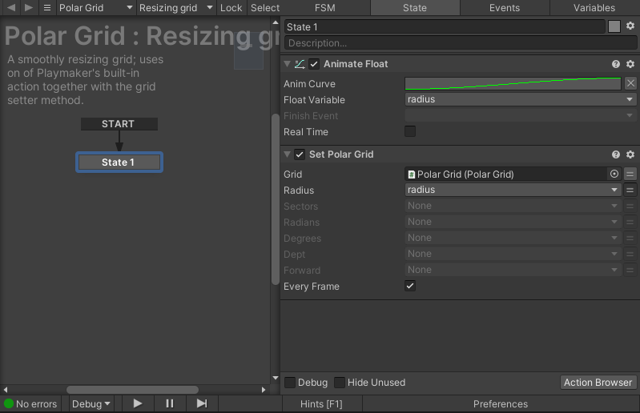

Let's have a mental exercise: image something shameful you have done, it
doesn't have to be the most shameful thing, just something that you really are
not proud of should do. Now imagine putting it in a sealed box where it will be
rotting and festering for years. Now imagine having to open that box, slowly
lifting the lid as the rancid smell starts creeping out of the box. That is how
it felt when I opened up the old [Playmaker] support.

I added Playmaker support due to popular demand and it should have been really
simple on paper: just provide actions which correspond to the classes and
methods we have. The problem is that I made a separate action for *every*
single thing you could possibly do. Want to get the radius of a polar grid?
That's one action. Want to get the angle of the same grid? That's another
action. Want to also set those two properties? That's two more actions. With
how many possible combinations of properties and methods there are, you can
easily imagine how it spiraled out of control very quickly.

## The new actions

I don't remember why I did it that way. Maybe it was the only way back then? Or
maybe I just didn't know what I was doing. Anyway, I decided to clean up real
good and merge actions which actually belong together. Getters and setters are
still separate actions, this is also how the official Playmaker actions work.

### Grid property accessors

Grid property getters are simple: they just read the property from a grid
object and make it available. All properties of a particular grid class have
been merged into one action per grid class. If we don't care about a particular
property we can simply ignore it.

Grid setters are a bit more complicated. For starters not all properties are
writeable, so some setter actions have fewer properties than their
corresponding setters. There is another problem though: what if we do not want
to set a particular property? This is where Playmaker variables come into play:
if a field is set to a variable, but the variable is `None`, then the field is
ignored and not set. This allows us to store all setters in one action, but
still retain the ability to pick and choose which setters to actually run.

### Coordinate conversion methods

The meat and potatoes of Grid Framework. For every grid class there is one
action with four fields:

- the input value
- the output value (a variable)
- The source coordinate system (an enum)
- The target coordinate system (an enum)

This slightly increases the size of each action, but it cuts down the number of
actions drastically.

## Conclusion

At present there are 28 individual actions. Out of those four are for
conversion, so that leaves 12 getters and setters each. That's still a lot, but
it is a far cry from the original count of 104 individual actions. Yeah, I'm
really not proud of that one, but now is the opportunity to make up for it and
get it right.

[Playmaker]: https://hutonggames.com/
